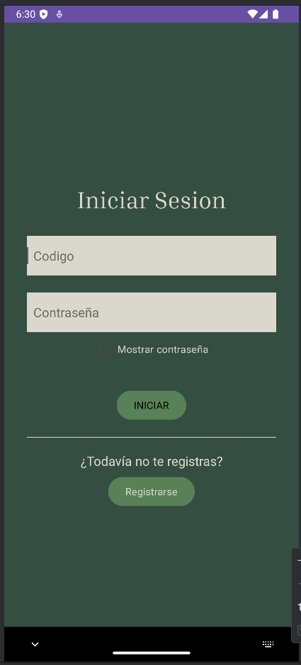
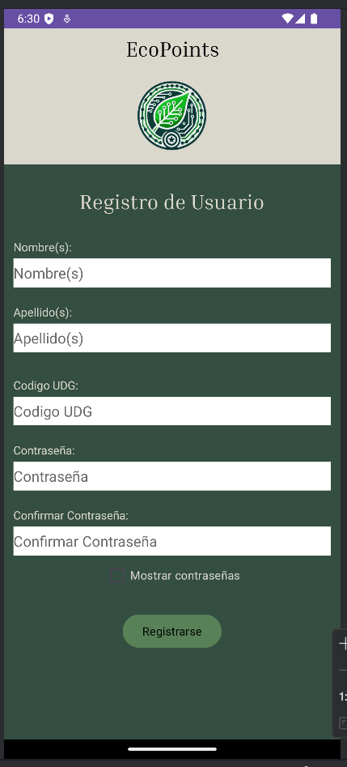
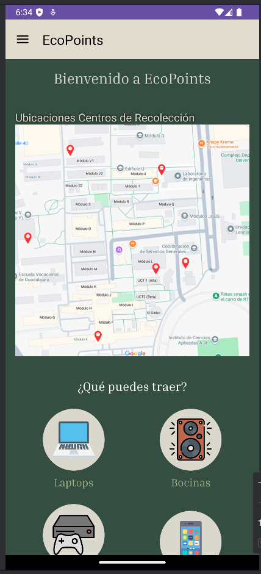
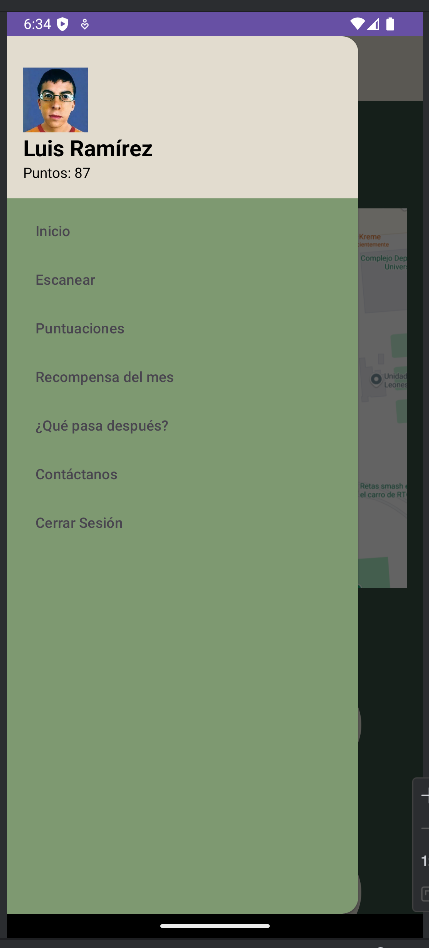
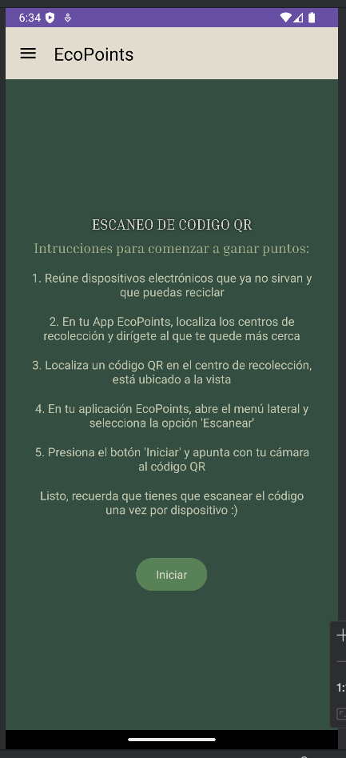
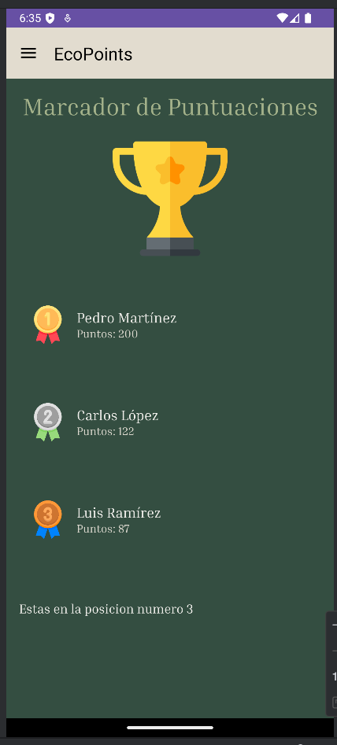
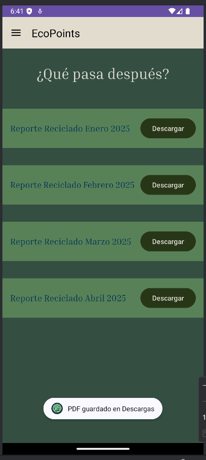
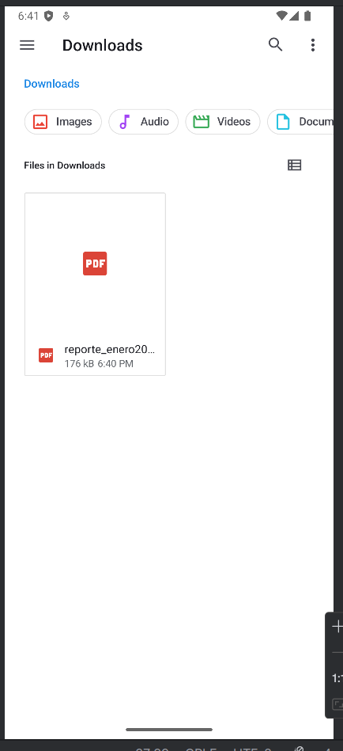
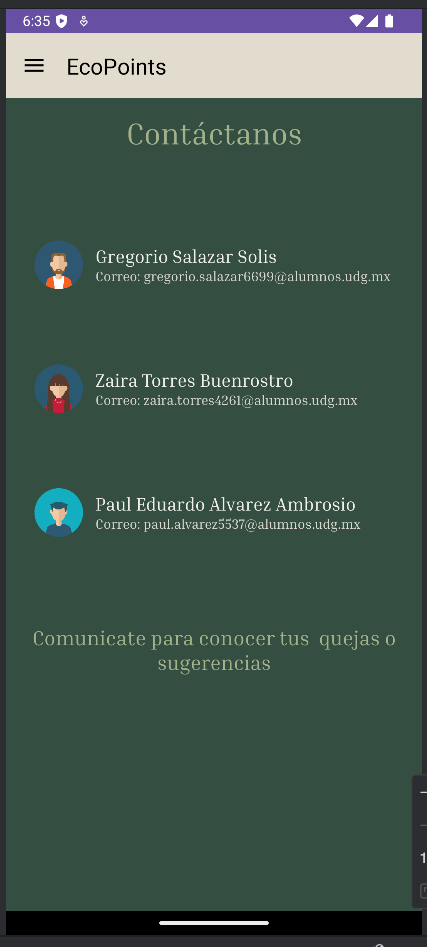

# App "EcoPoints"
El tema a tratar era la gestión del manejo de desperdicios electrónicos dentro del centro universitario. Esta app se creó como un sistema por puntos, a lo largo del centro universitario habría módulos
para llevar los desperdicios electrónicos y se escanearía un código QR que te sumaria puntos (el código se escanea una vez por residuo). Se implemento un sistema de puntos para incentivar a la comunidad universitaria a 
participar, al final del mes la persona que más puntos genero ganaría algún "premio" que los desarrolladores habrían establecido.

## Secciones de la App

* **Iniciar Sesión:** El acceso a la app se estableció para la comunidad universitaria, por lo que se ingresa con un código numérico de 9 dígitos (código estudiantil) y una contraseña creada por el usuario. En caso de ser usuario nuevo, existe un botón para registrarse

 

* **Registro:** En este apartado cualquier persona que pertenezca a la red universitaria se podrán registrar, solo tendrán que proporcionar datos como nombre y apellidos, su código universitario, contraseña y confirmación de contraseña. 

 

* **Pantalla de Inicio**: Al iniciar sesión, lo primero que se ve es el mapa de la universidad con la ubicación de los contenedores donde se recolectan los residuos electrónicos, además de un listado de ejemplos de residuos que se aceptan

 
 

* **Menú de Opciones**: En la esquina superior izquierda hay un menú de opciones, al presionarlo se puede navegar entre las diferentes secciones que tiene la app además de poder cerrar sesión. También puedes ver tu nombre y los puntos que tienes registrados

 

* **Escaneo QR:** Para implementar el escaneo de QR, se usó la librería ZXing, y en pantalla se muestran las instrucciones de como escanear el código QR. Al escanear el código QR, el usuario recibirá de 3 a 15 puntos. Los puntos del usuario se actualizan de forma global
  
 

* **Puntuaciones:** Se muestra a los 3 usuarios con más puntos, y hasta abajo sale la posición en la que se encuentra tal usuario. 
  
 

* **Recompensa del mes:** La idea es que cada mes de calendario, exista la oportunidad de que los usuarios ganen una recompensa. En esta sección se muestra cual es la recompensa que los desarrolladores decidieron dar
  y el tiempo restante del mes (mostrado con un contador) para que sepan el tiempo que les queda para sumar la máxima cantidad de puntos posibles
  
 

* **¿Que pasa después?:** Con el objetivo de que los usuarios sepan que pasa con los residuos electrónicos que se juntaron, su subirán a la app reportes mensuales sobre datos del programa, es decir, cuanto se juntó, por cuando se vendió,
 que se hizo con el dinero del reciclado, a que recicladora se llevaron los residuos, etc. Y los usuarios podrán descargar estos reportes en su propio celular
  
  

* **Contactos:** Se incluyo una sección donde los usuarios tienen el nombre y correo de los desarrolladores de la app. Ya sea para que den una sugerencia de mejora, algún error encontrado, dudas, etc.
*   

